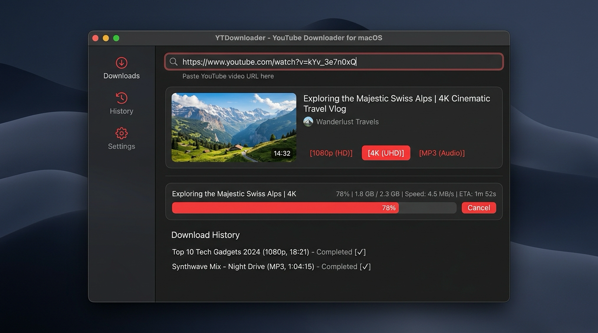

🇰🇷 [한국어](README.md) | 🇺🇸 [English](README.en.md) | 🇯🇵 [日本語](README.ja.md) | 🇨🇳 [中文](README.zh.md)

<p align="center">
  
</p>

<h1 align="center">YTDownloader</h1>

<p align="center">
  <a href="https://github.com/yt-dlp/yt-dlp">yt-dlp</a> を利用したmacOSネイティブの動画ダウンロードGUIアプリ。<br />
  YouTubeのURLを貼り付け、画質を選んですぐにダウンロードできます。
</p>

<p align="center">
  
</p>

## 主な機能

- URLを貼り付けるだけでタイトルやサムネイル、選択可能な解像度を自動取得
- ダウンロード前の解像度・フォーマット選択
- リアルタイムな速度と残り時間の表示
- 一時停止と再開に対応

## インストール

### Homebrew
```bash
brew tap mrKangHo/tap
brew install youtubedownloader
```
